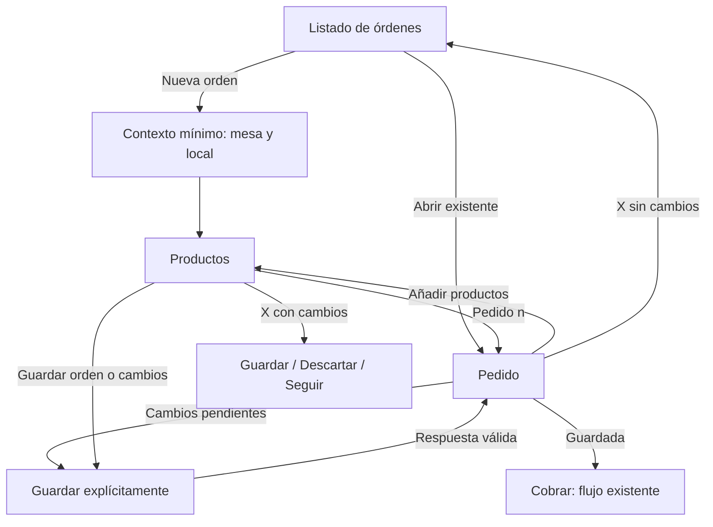

# Investigación UX — POS mobile

Fecha: 2026-10-08. Investigación de GPT con un agente dedicado a UX de POS mobile.
Estado: propuesta para revisar; no es una spec cerrada ni autoriza implementación.
Rama dev, sin merge ni push. No se cambió código de producto.

## Conclusión

El POS necesita organizarse alrededor de un pedido que se puede continuar, revisar,
guardar y cobrar. Hoy esos trabajos se reparten entre un ticket de lectura, una vista
Editar y un formulario Nueva orden. Los cambios recientes de cabecera y botones
mejoraron la presentación, pero dejaron esa separación de tareas intacta.

Recomendación: un espacio de pedido común para nueva orden y orden existente,
con dos vistas internas, **Productos** y **Pedido**. Ambas comparten el mismo
borrador y contexto de mesa/local. El ticket impreso permanece como una salida
específica; su formato no debe determinar la interacción de trabajo.

Esto es una evaluación heurística de código, capturas y documentación de productos.
No hicimos entrevistas ni pruebas con operadores; frecuencia de tareas y mejora de
velocidad son hipótesis que deben medirse, no resultados demostrados.

## Evidencia del producto actual

Se inspeccionaron consola, editor, carrito, catálogo compartido y contrato 0169.
Capturas de orden abierta actuales: /private/tmp/pos-0177-mobile.png y desktop.
Captura de catálogo: test-results/pos-POS-reutiliza-catálogo-d6c92-rusel-búsqueda-y-cantidades/pos-catalog-mobile.png.
Esta última viene de la prueba de catálogo y muestra el editor con mesa/local ya
rellenados; no representa la pantalla vacía ni el teclado real. La estructura coincide
con el editor actual. No se probó servicio real ni cámara/impresora físicas. El agente independiente
coincide en priorizar continuidad de pedido, contexto compacto y prevención de
abandono; no realizó cambios ni escrituras reales.

| Prioridad | Hallazgo observado | Efecto que proponemos validar |
| --- | --- | --- |
| P0 | Abierta muestra ticket; continuar pedido requiere Editar → catálogo → Guardar → ticket (`pos-console.tsx`). | Cambios de pantalla repetidos para la tarea habitual de agregar consumos. |
| P0 | Nueva orden tiene cabecera POS, explicación y Card con título/local/mesa antes de productos (`pos-editor.tsx:103`). | En captura 390×844, primer producto empieza aproximadamente en y=551 y footer en y=727: queda una fila completa de productos. |
| P0 | X en edición llama back y desmonta editor; Cancelar existente vuelve a detalle. No hay confirmación de borrador modificado. | Pérdida involuntaria y dos salidas con consecuencias difíciles de distinguir. |
| P1 | Carrito se abre dentro del footer fijo con max-h-64 y overflow-auto (`pos-cart.tsx:116`). | Scroll anidado y área útil variable; revisar cantidades compite con explorar catálogo. |
| P1 | Local vacío bloquea catálogo si hay varios locales; cambiarlo conserva las líneas anteriores. | Inicio sin productos y riesgo de atribuir consumos al local equivocado. Conservar snapshots es correcto; falta explicar el efecto del cambio. |
| P1 | Pantalla abierta mantiene fecha/autor y leyenda fiscal visibles antes que herramientas para continuar el pedido. | Jerarquía orientada a documento en vez de operación. |
| P1 | Búsqueda sustituye el carrusel mientras está activa (`sale-forms.tsx:197`). | El operador pierde contexto de categoría; revisar búsqueda con menús grandes antes de rediseñar el componente compartido. |

La gran zona vacía en una orden de un producto no obliga a rellenar pantalla.
La mejora debería dar continuidad y claridad a la tarea, evitando agregar decoración.

## Patrones documentados

- Square permite abrir/guardar un ticket antes del cobro y añadir productos en otro
  momento. También documenta una ruta que empieza con productos y después identifica
  el ticket. Esto muestra que identificación y cobro pueden acomodarse al servicio,
  sin copiar un único orden de pasos. [Open Tickets](https://squareup.com/help/us/en/article/5337-use-open-tickets-with-square).
- Square tableside reúne añadir artículos y revisar la cuenta dentro del trabajo de
  una mesa. Su panel de cuenta actualizado al configurar artículos se describe como
  beta; no lo tomamos como capacidad universal. [Tableside mobile POS](https://squareup.com/help/gb/en/article/8152-take-orders-tableside-with-square-for-restaurants-mobile-pos).
- Shopify carga una orden borrador directamente en el carrito y guarda sus cambios
  mediante una actualización explícita. Es una referencia útil para continuidad sin
  requerir auto-save. [Draft orders](https://help.shopify.com/en/manual/sell-in-person/shopify-pos/order-management/draft-orders).
- Toast handheld documenta cabecera que se contrae al agregar productos, menú
  expandible y acciones persistentes. Reserva overflow para acciones menos usadas;
  conserva Print/Pay visibles, por lo que imprimir debe clasificarse según uso real.
  [Ordering screens](https://support.toasttab.com/en/article/New-POS-Experience-Ordering-Screens).
- Apple recomienda un área táctil de al menos 44×44 puntos para sus plataformas.
  Para nuestra web proponemos controles de 44–48 CSS px como objetivo de diseño,
  a probar en dispositivos reales; no son una equivalencia normativa entre unidades.
  [Buttons](https://developer.apple.com/design/human-interface-guidelines/buttons).

La arquitectura propuesta a continuación es una inferencia para CheckPass, no una
recomendación literal de esas empresas ni evidencia de mejoras medidas aquí.

## Orden abierta propuesta

Entrar abre **Pedido**: mesa y local compactos, líneas de productos, cantidades y
subtotal. Controles de cantidad accesibles allí, sin entrar a un modo Editar.
**Añadir productos** abre Productos dentro del mismo pedido; volver conserva filtros,
scroll y borrador. La información secundaria de fecha/autor va en Detalles.

Footer compacto de una fila útil, con total y acción contextual. Con orden guardada:
**Cobrar** es primaria, **Añadir productos** acceso directo. Al modificar algo:
**Guardar cambios** pasa a primaria y se muestra **Cambios sin guardar**. No se cobra
un importe distinto del snapshot persistido; volver a Cobrar requiere guardar primero.
La forma exacta de ese paso se define en la spec con los estados de fallo/conflicto.

Imprimir precuenta y Anular pueden quedar en un menú de acciones con nombre accesible.
Si el owner confirma que imprimir es frecuente, conservar un acceso directo pequeño.
Anular nunca comparte prominencia con la tarea de tomar pedido y conserva confirmación.

## Nueva orden propuesta

Usa el mismo espacio. Cabecera Nueva orden, X y contexto compacto. Un solo local se
muestra como dato, sin selector. Con varios: recuperar el último local elegido dentro
de la sesión autorizada; si no hay uno válido, pedir selección explícita sin elegir
silenciosamente el primero. Nombre de mesa en campo compacto sin Card exterior.
Tras identificar contexto, **Productos** queda como superficie principal.

Catálogo mantiene los más vendidos enviados por servidor, carrusel y componentes de
Mostrador. No calcular ranking nuevo. Selección añade al mismo borrador, con cantidad
visible y resumen de artículos/total persistente. **Pedido (n)** abre una vista de
revisión completa, con un solo scroll de contenido; no expande una lista sobre el footer.

Primaria: **Guardar orden**. No crear ni guardar en la DB por cada toque. La API
permite guardar mesa vacía; ofrecer esa opción de forma explícita y explicar que se
pueden agregar productos luego. No mostrar una acción principal permanentemente
inhabilitada sin indicar qué falta (mesa, local o precio requerido).

El teclado debe permitir completar mesa y pasar a productos sin tapar la acción,
y la búsqueda debe conservar contexto al cerrar. Esto exige pruebas iOS/Android:
las capturas de escritorio con viewport pequeño no demuestran comportamiento de teclado.

## Esquema de navegación

Diagrama conceptual: las dos vistas internas comparten borrador; cambiar vista no
implica GET ni PUT. Un conflicto no se resuelve sobrescribiendo silenciosamente.

## Condiciones que deben quedar en la spec

1. Identidad/local visibles y aislamiento del borrador. Cambio de local con consumos
   requiere confirmar o cancelar; nunca borrar o reprecificar líneas silenciosamente.
2. Separar guardado/sin guardar/guardando/fallo/conflicto con copy visible. Un error
   conserva borrador. La salida protegida debe cubrir X y navegación interna pertinente.
3. Conservar lineId y snapshots distintos: una lista agrupada de cantidades no puede
   fusionar líneas de precios diferentes ni eliminar productos borrados del catálogo.
4. Cantidad cero y retirada de línea con consecuencia clara; no cobrar orden vacía.
5. Sin auto-save, polling, TTL ni refresco por foco. API actual y caché siguen vigentes;
   datos de otros operadores se validan al escribir según contrato.
6. No agregar mesas predeterminadas, plano, stock, cocina, propinas o división de cuenta:
   0169 no ofrece esas capacidades. El nombre de mesa es libre y no valida duplicados.
7. Reusar kit/Tailwind/tokens y catálogo de Mostrador. Un menu/sheet o primitiva que falte
   se pide a Claude; no construirla a mano ni tocar el kit desde GPT.

## Comparación de alternativas

| Propuesta | Beneficio | Coste o límite |
| --- | --- | --- |
| Compactar formulario y recolocar botones manteniendo las cuatro vistas | Menos scroll inicial | Conserva el paso repetido Editar; resuelve solo parte del problema. |
| Espacio común Pedido/Productos (recomendada) | Continuidad de pedido y revisión explícita | Requiere definir estado del borrador, salida y cobro; spec funcional y pruebas de transición. |
| Catálogo y carrito simultáneos en columnas | Rápido en tablet/desktop | En teléfono reduce demasiado ancho; no es solución mobile. |

## Validación antes de implementar toda la UI

Probar primero un prototipo con 3–5 operadores si están disponibles; observar tareas,
no pedir solamente si les gusta. Usar 360/390 px, catálogo de 30–60 productos, nombres
largos, dos locales y teclado real. Mantener importes/precios duplicados y conexión lenta.

| Tarea | Criterio propuesto |
| --- | --- |
| Nueva mesa con tres productos de dos categorías | Completa sin ayuda; identifica dónde guardar y no pierde productos. |
| Abrir y sumar una unidad; guardar | No requiere entrar en Editar; cantidad/total/snapshot coinciden. |
| Revisar 15 líneas y volver a catálogo | Un solo scroll principal; conserva filtro, posición y selección. |
| X con cambios pendientes | Nadie pierde cambios sin una decisión explícita. |
| Cambiar local con líneas existentes | Entiende qué cambia; no se reprecifica ni mezcla contexto inadvertidamente. |
| Cobrar después de agregar un producto | Confirma que se cobrará la versión guardada correcta. |
| Error de guardado o conflicto | Conserva la intención del operador y entiende cómo recuperarse. |

Medir tiempos y toques contra la UI actual, abandonos, errores y solicitudes de ayuda.
Incluir aserción técnica de cero GET/PUT adicionales por alternar Pedido/Productos.
No fijar un porcentaje de mejora sin línea base. Meta estructural: quitar el modo Editar
como paso obligatorio; tener productos y acciones relevantes visibles sin scroll inicial
excesivo; no pérdida accidental. La decisión de imprimir directo o en menú se valida allí.

## Entrega y siguiente trabajo

Solo investigación. Propuesta pendiente de revisión de producto; no hay nueva spec
implementable cerrada. El siguiente trabajo sería una maqueta navegable de ambos flujos,
definir las decisiones de guardado/salida y cerrar una spec contra el contrato 0169.
